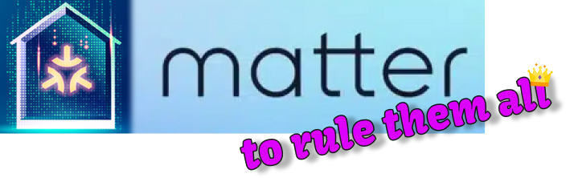

#  Table of contents

* [Project overview](https://github.com/marcin-ch/Matter_User_Experience#project-overview)
* [Commercially available Matter enabled devices](https://github.com/marcin-ch/Matter_User_Experience#commercially-available-matter-enabled-devices)
* [Getting started with Meross MSS315 plug](https://github.com/marcin-ch/Matter_User_Experience#getting-started-with-meross-mss315-plug)
  * [System requirements](https://github.com/marcin-ch/Matter_User_Experience#system-requirements)
  * [Is hub required?](https://github.com/marcin-ch/Matter_User_Experience#is-hub-required)
  * [List of Matter hubs](https://github.com/marcin-ch/Matter_User_Experience#list-of-matter-hubs)
  * [Hub is here, what is next?](https://github.com/marcin-ch/Matter_User_Experience#hub-is-here-what-is-next)
  * [My working setup for Meross MSS315 plug](https://github.com/marcin-ch/Matter_User_Experience#my-working-setup-for-meross-mss315-plug)
  * [Commissioning Meross MSS315 plug and demo](https://github.com/marcin-ch/Matter_User_Experience#commissioning-meross-mss315-plug-and-demo)
* [Wi-Fi light bulb app with Espressif ESP32-C3-DevKitM-1](https://github.com/marcin-ch/Matter_User_Experience#wi-fi-light-bulb-app-with-espressif-esp32-c3-devkitm-1)
  * [My working setup for Espressif ESP32-C3-DevKitM-1](https://github.com/marcin-ch/Matter_User_Experience#my-working-setup-for-espressif-esp32-c3-devkitm-1)
  * [Flashing Espressif ESP32-C3-DevKitM-1](https://github.com/marcin-ch/Matter_User_Experience#flashing-espressif-esp32-c3-devkitm-1)
  * [Commissioning Espressif ESP32-C3-DevKitM-1](https://github.com/marcin-ch/Matter_User_Experience#commissioning-espressif-esp32-c3-devkitm-1)
  * [Wi-Fi light bulb demo](https://github.com/marcin-ch/Matter_User_Experience#wi-fi-light-bulb-demo)
* [Wi-Fi door lock app with Infineon CY8CKIT-062S2-43012](https://github.com/marcin-ch/Matter_User_Experience#wi-fi-door-lock-app-with-infineon-cy8ckit-062s2-43012)
  * [My working setup for Infineon CY8CKIT-062S2-43012](https://github.com/marcin-ch/Matter_User_Experience#my-working-setup-for-infineon-cy8ckit-062s2-43012)
  * [Flashing Infineon CY8CKIT-062S2-43012](https://github.com/marcin-ch/Matter_User_Experience#flashing-infineon-cy8ckit-062s2-43012)
  * [Commissioning Infineon CY8CKIT-062S2-43012](https://github.com/marcin-ch/Matter_User_Experience#commissioning-infineon-cy8ckit-062s2-43012)
  * [Wi-Fi door lock demo](https://github.com/marcin-ch/Matter_User_Experience#wi-fi-door-lock-demo)
* [Project summary](https://github.com/marcin-ch/Matter_User_Experience#project-summary)

# Project overview
This is user experience story with Matter as this protocol has been getting hotter and hotter. As some of products have got their Matter stickers already (please note that Matter specification is still under development), let's dive a bit into how it can make our lives (and our smart homes) easier. Or not🤣 

# Commercially available Matter enabled devices
There are few Matter enabled devices on the market right now such as:
* [Meross MSS315 plug] (Matter over Wi-Fi),
* [TP-Link Tapo P125M plug] (Matter over Wi-Fi),
* [Eve Energy plug] (Matter over Thread)

I have chosen [Meross MSS315 plug] as it is Matter over Wi-Fi device (who does not have Wi-Fi today...🤣) and available in European version.

# Getting started with [Meross MSS315 plug]
I have started my journey with picking up the parcel.

## System requirements
[Meross MSS315 plug] cardboard box contains system requirements as shown below:
| | |
|-|-|
| 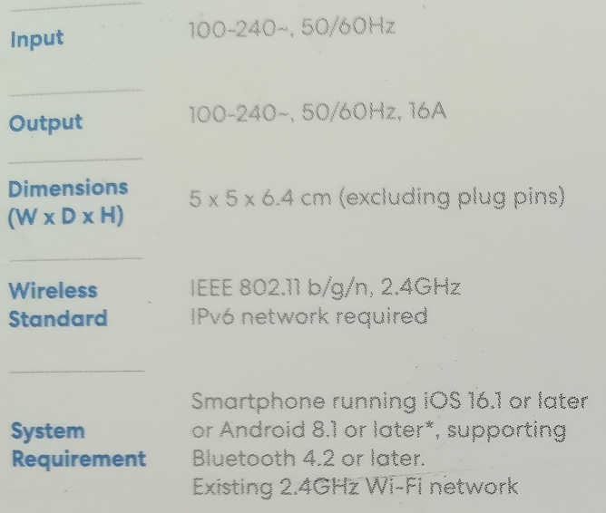 | 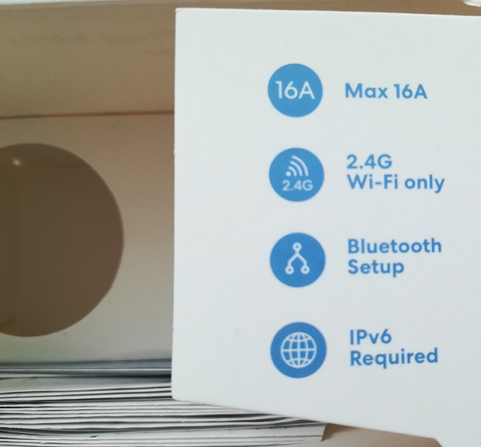 |

The requirements are as follows:
* 2.4GHz Wi-Fi (802.11 b/g/n) network with IPv6 support
  * please check your Wi-Fi access point settings, especially to confirm whether there is a support for IPv6
* smartphone with iOS not older than 16.1 and Bluetooth enabled

Manufacturer also provides online version of [system requirements for Matter devices].

## Is hub required?
Having in mind Matter architecture (**only Wi-Fi part of architecture** as I am leaving Thread for further investigation):

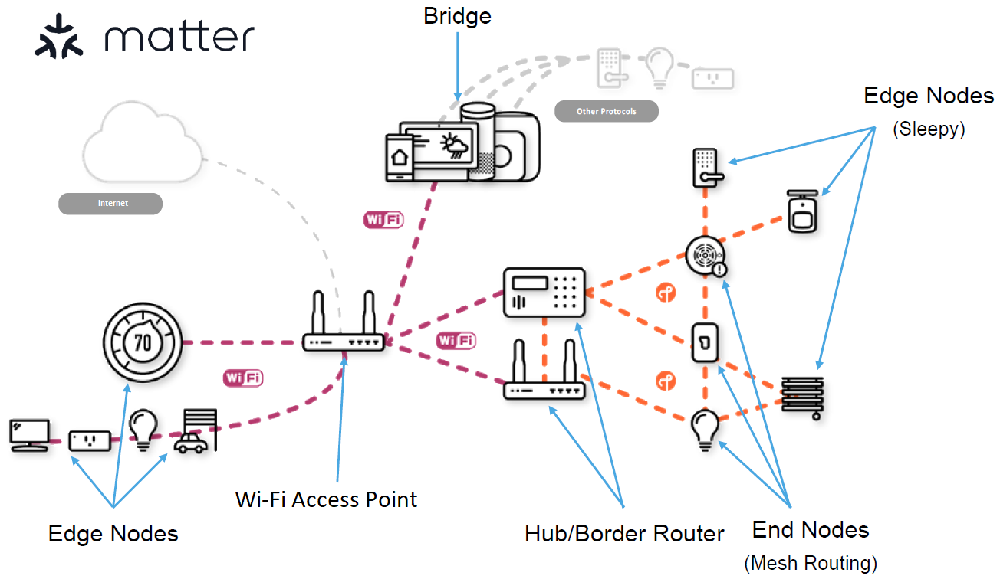

I strongly believed that for Matter over Wi-Fi no additional hardware is required: only your home Wi-Fi access point, smartphone and Matter accessory. However, seems one more thing is still missing, i.e. **hub**.

I have tested 4 applications (Apple Home, Amazon Alexa, Google Home and native app from vendor Meross, all apps freshly installed from App Store) on the iPhone 13 with iOS updated very recently to **16.5** (seems the newer the better as, for example, Google Home app was complaining when iOS was 16.3 and requesting to update to newer iOS version). What is more, at the end of June 2023 iOS has been updated to **16.5.1**.

Unfortunately, this is short story here as adding this smart plug to any of mentioned above ecosystems requires having a hub. **And seems this is common for all Matter enabled devices.** Below example for Apple Home app:

The table combines outputs from all apps:

|   | Apple Home | Amazon Alexa | Google Home | Meross |
|---|------------|--------------|-------------|--------|
|   | Hub required | Hub required  | Hub required | Hub required |
| iPhone 13 (iOS 16.5) | 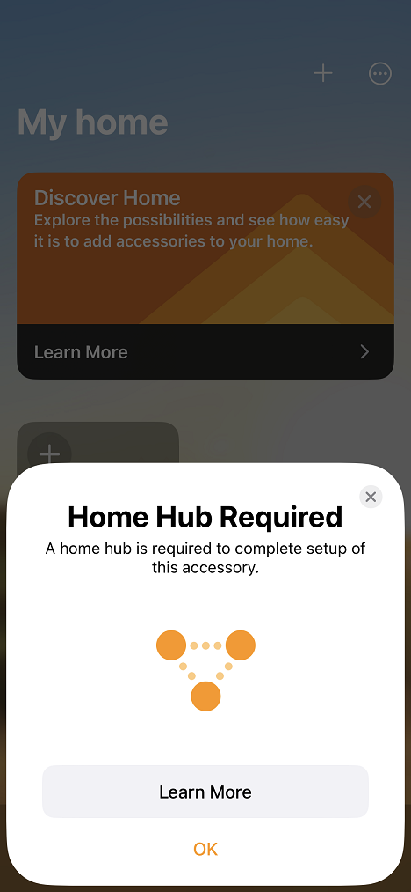 | 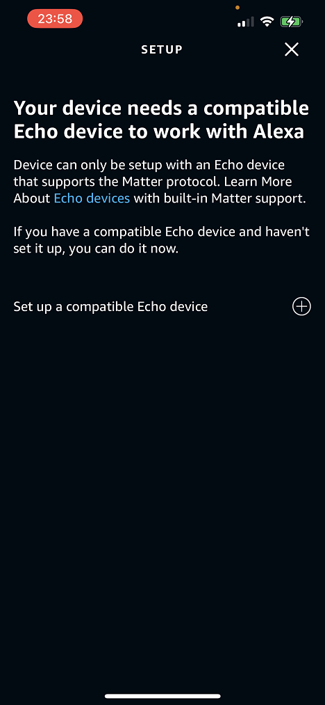 | 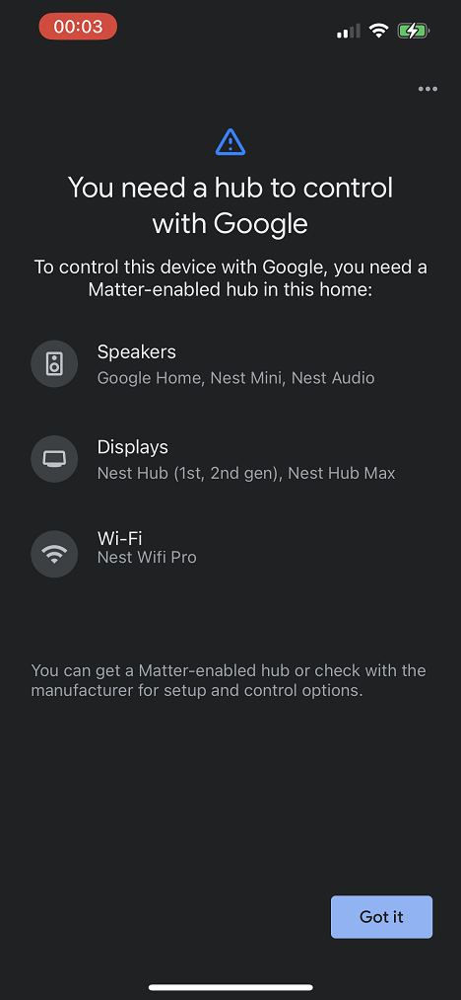 | 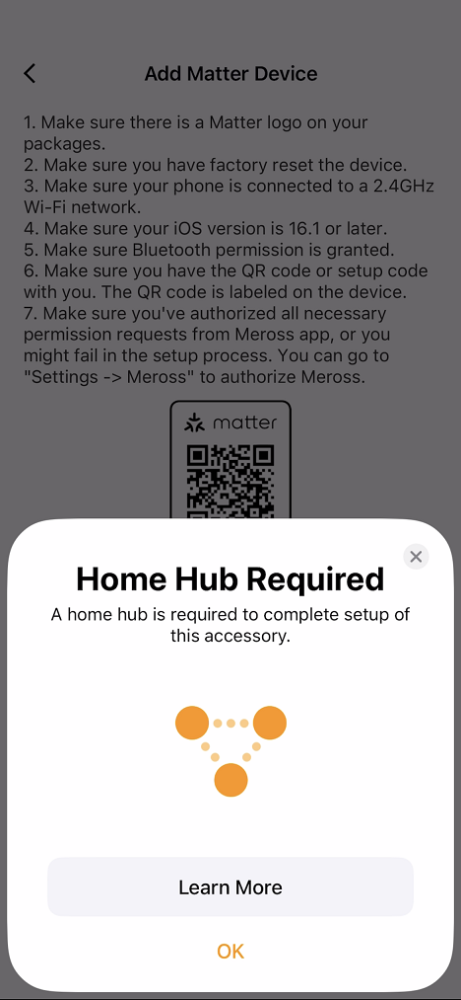 |

* Apple Home app
  * *Home Hub Required. A home hub is required to complete setup of this accessory.*
    * you can use HomePod / HomePod mini / Apple TV (only particular hardware and software versions)
* Amazon Alexa app
  * *Your device needs a compatible Echo device to work with Alexa. Device can only be setup with an Echo device that supports the Matter protocol.*
    * I would suggest to double-check what Amazon hardware supports Matter hub functionality
* Google Home app
  * *You need a hub to control with Google. To control this device with Google, you need a Matter-enabled hub in this home.*
    * I would suggest to double-check what Google hardware supports Matter hub functionality
* Meross app
  * the same as for Apple Home app: *Home Hub Required. A home hub is required to complete setup of this accessory.*

I have been in touch with Meross support and they confirmed that Matter accessories require the use of a device such as the HomePod as a home hub. They provided as well [system requirements for Matter devices].

---

**ℹ️ Note:** Working with Matter accessories requires a hub. Choice of hub depends on ecosystem you would like to use for controlling you home. Refer please to [List of Matter hubs].

---

## List of Matter hubs
I would say here that this needs to be double-checked from time to time as vendors prepare software updates and, hopefully, more and more devices can act as a compatible Matter hub. Besides the link from Meross ([system requirements for Matter devices]), I found **very useful** link from Eve presenting [which hub is right for me].

## Hub is here, what is next?
I have chosen **HomePod mini** as, based on many tutorials, it should provide reliable way of working with Matter, not too painful. I hope so!🤣

As [Meross MSS315 plug] **requires 2.4GHz Wi-Fi network**, please bear in mind to connect HomePod mini to the same 2.4GHz network, not 5GHz. Otherwise, you will be suprised by this notification:

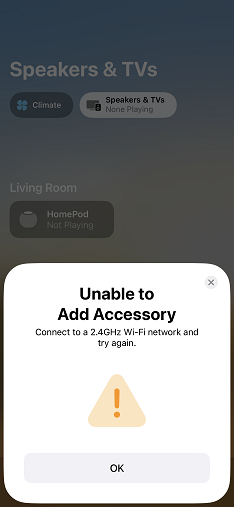

Therefore, let's try to commission the plug into Apple Home ecosystem but before that let me summarize my setup enabling working with [Meross MSS315 plug].

## My working setup for [Meross MSS315 plug]

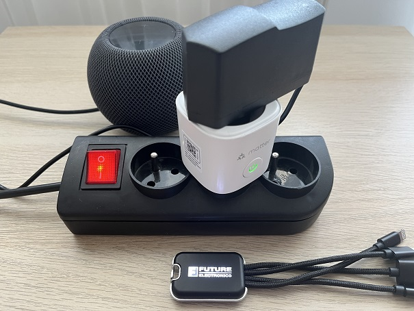

Let me summarize my setup enabling working with [Meross MSS315 plug]:
* 2.4GHz Wi-Fi network, IPv6 support
  * the plug does not work with 5GHz
* [Meross MSS315 plug]
* fancy LED sticker (LED is ON when plug is switched on, and LED is OFF when plug is switched off)
* HomePod mini connected to 2.4GHz Wi-Fi network
* iPhone 13 with the latest iOS (in my case 16.5.1) connected to 2.4GHz Wi-Fi network and Bluetooth enabled

## Commissioning [Meross MSS315 plug] and demo
The workflow is as follows:
* power up [Meross MSS315 plug]
  * LED should be blinking green and orange, if not please make factory reset by holding ON/OFF switch for 5 seconds 
* open default camera application of your iPhone
* scan the QR code placed on [Meross MSS315 plug]
* follow the workflow required by the ecosystem (Apple Home in my case), keeping your phone close to the plug (commissioning is being done via Bluetooth)
* finally, you get in your smart home plug accessory you can make ON and OFF
  * if you want to repeat commissioning process (for example to change the network to connect to) you need to make factory reset again
  
You can see whole described workflow and demo below:

I have connected to the plug fancy LED sticker which indicates whether plug is ON or OFF (LED sticker is ON when plug is switched on, and LED is OFF when plug is switched off).

# Wi-Fi light bulb app with [Espressif ESP32-C3-DevKitM-1]

As I have my first Matter enabled device [Meross MSS315 plug] working, let's try to add another Matter accessory. This time from different vendor, i.e. **Espressif**.

Recently, Espressif released set of trainings related to Matter and they are available here:
* [Introduction to Matter]
* [Building a Matter Device]
* [Matter Certification & Device Certificates]

I am referring to the second one especially, i.e. [Building a Matter Device] as it provides a hands-on experience on building Matter device. Therefore, with no further delay let's check it out!😎

Let's start with hardware: they use [Espressif ESP32-C3-DevKitM-1] (not shown explicitly in the video, but Espressif team confirmed that for me). It is based on [ESP32-C3-MINI-1 module] which contains [ESP32-C3 SoC] (Wi-Fi/Bluetooth RISC-V SoC).

When it comes to programming tools, Espressif provides web-based platform called [ESP Launchpad] which is the easiest way to flash the selected firmware onto ESP32 SoC.

## My working setup for [Espressif ESP32-C3-DevKitM-1]

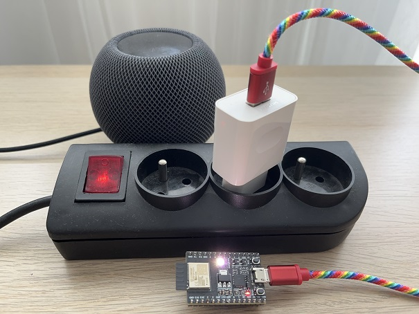

Let me summarize my setup enabling working with [Espressif ESP32-C3-DevKitM-1]:
* 2.4GHz Wi-Fi network, IPv6 support
* [Espressif ESP32-C3-DevKitM-1]
  * USB-UART bridge present on the evaluation board is Silicon Labs CP2102 and most probably you will need to install related drivers, please refer to [Silicon Labs CP210x USB to UART Bridge Virtual COM Port (VCP) Drivers](https://www.silabs.com/developers/usb-to-uart-bridge-vcp-drivers?tab=downloads)
    * if everything is fine with the drivers you will see your evaluation board populated as *Silicon Labs CP210x USB to UART Bridge (COMxx)* in your *Device Manager* under the section *Ports (COM & LPT)* (refers to Windows)
* [ESP Launchpad]
  * Chrome web browser is recommended as ESP Launchpad does not work from Firefox & Safari
* HomePod mini connected to 2.4GHz Wi-Fi network
* iPhone 13 with the latest iOS (in my case 16.5.1) connected to 2.4GHz Wi-Fi network and Bluetooth enabled

## Flashing [Espressif ESP32-C3-DevKitM-1]
Following the training [Building a Matter Device] the workflow is:
* connect [Espressif ESP32-C3-DevKitM-1] to your PC
  * use the only one available micro USB port🤣
* open [ESP Launchpad] in Chrome web browser and hit **Connect** at the top of the page
* select application **light** and choose ESP chipset type **ESP32C3**
* hit **Flash**
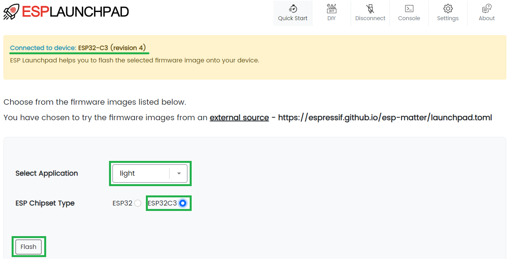
* once flashing is completed, hit the **Reset Device** to reset your device with the new flashed firnware
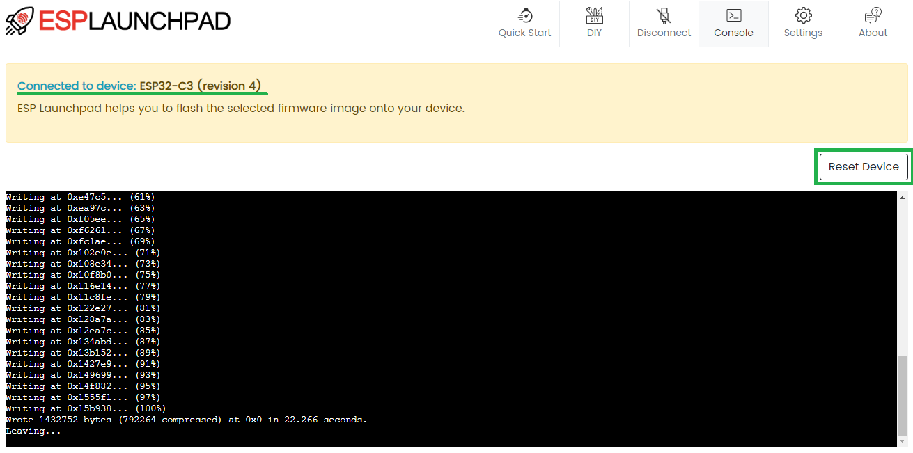
* the board is ready for further examination!

## Commissioning [Espressif ESP32-C3-DevKitM-1]
Hey, where is QR code?

QR code has been taken from [Espressif SDK for Matter] and uses the **test Vendor ID (VID)** and **Product ID (PID)**. I have copied it here for ease of use:

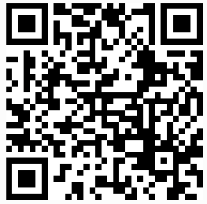

Having the firmware (ligh bulb application) flashed and QR code prepared, I am ready now to commission the board into my ecosystem (Apple Home in my case):
* connect [Espressif ESP32-C3-DevKitM-1] to your PC
* open default camera application of your iPhone
* scan the QR code placed above
* follow the workflow required by the ecosystem (Apple Home in my case), keeping your phone close to the board (commissioning is being done via Bluetooth)
* finally, you get in your smart home light bulb accessory you can make ON and OFF, adjust brightness and color temperature (between warm, cool and neutral white)
  * if you want to repeat commissioning process (for example to change the network to connect to) you need to follow flashing process again
  
You can see whole described workflow below:

## Wi-Fi light bulb demo

You can toggle ON and OFF states, adjust brightness and color temperature (between warm, cool and neutral white).

I have noticed when you are adjusting color temperature there is a glitch and new value of color temperature is not being saved. You can see that in *Adjusting color temperature* section of the above video, when I am changing color on the left hand side to more warm white, however it remains not changed. The same few moments later during changing warm white to cool white (pallette underneath remains not changed).

# Wi-Fi door lock app with [Infineon CY8CKIT-062S2-43012]

I have my smart home containing two Matter accessories right now, [Meross MSS315 plug] and [Espressif ESP32-C3-DevKitM-1] which emulates light bulb. Let's add another one, i.e. [Infineon CY8CKIT-062S2-43012] which demonstrates Wi-Fi door lock device functionality.

[Infineon CY8CKIT-062S2-43012] development board is based on [Infineon PSoC62 series MCU]. The kit also includes [Murata Type 1LV Wi-Fi/Bluetooth module] (based on the [Infineon AIROC CYW43012 Wi-Fi/Bluetooth chipset]) to develop cloud connected IoT applications including **Matter over Wi-Fi applications**. And this is the most interesting for me😎

Infineon provides application note named [AN237138 Getting started with Matter over Wi-Fi on PSoC6 MCUs in ModusToolbox] and I will be following it.

When it comes to programming tools, there are few methods to build an application mentioned in the above aplication note, i.e.:
* using [Project CHIP's Github Matter PSoC6 Lock Example]
* using [Infineon's Github Matter PSoC6 Lock Example]
* using [Infineon’s IDE ModusToolBox]

As the two first methods are mainly based on Linux and Mac environment, Windows Subsystem for Linux (WSL) or similar tools (such as virtual machines) may be required if the user is working on Winsows system. Therefore, [Infineon’s IDE ModusToolBox] is my choice😎

## My working setup for [Infineon CY8CKIT-062S2-43012]

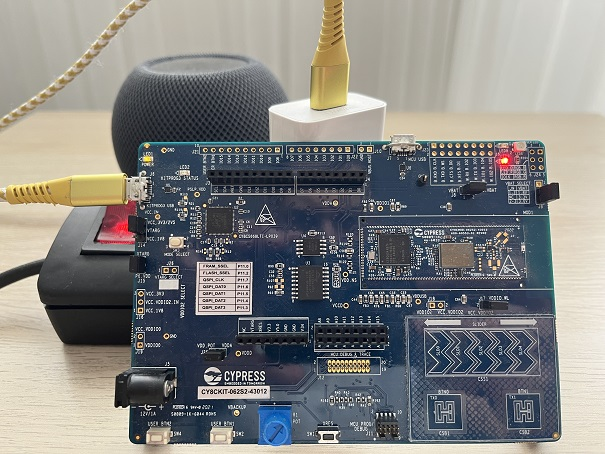

Let me summarize my setup enabling working with [Infineon CY8CKIT-062S2-43012]:
* 2.4GHz Wi-Fi network, IPv6 support
* [Infineon CY8CKIT-062S2-43012]
  * necessary drivers should have been installed along with the [Infineon’s IDE ModusToolBox] installation  
  * if everything is fine with the drivers you will see your evaluation board populated as *KitProg3 USB-UART (COMxx)* in your *Device Manager* under the section *Ports (COM & LPT)* (refers to Windows)
* [Infineon’s IDE ModusToolBox]
  * I have been using `Version: 3.0.0 Eclipse Build ID: 2749`
* HomePod mini connected to 2.4GHz Wi-Fi network
* iPhone 13 with the latest iOS (in my case 16.5.1) connected to 2.4GHz Wi-Fi network and Bluetooth enabled

## Flashing [Infineon CY8CKIT-062S2-43012]
Following the [AN237138 Getting started with Matter over Wi-Fi on PSoC6 MCUs in ModusToolbox] the workflow is:
* connect [Infineon CY8CKIT-062S2-43012] to your PC
  * use **KITPROG3 USB** (**J6**) connector on the left hand side of the board
* open [Infineon’s IDE ModusToolBox], select workspace and hit **Launch**
* from **Quick Panel** select **New Application** and then filter for **CY8CKIT-062S2-43012**, select **right BSP** and hit **Next**
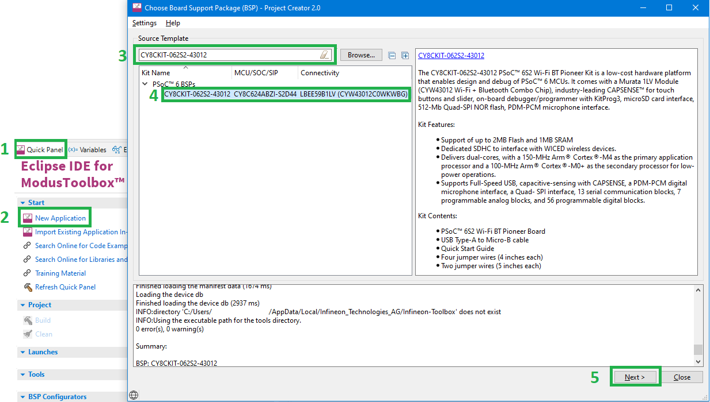
* under the **Connectivity** section, select *Matter Wi-Fi Door Lock* application and hit **Create**
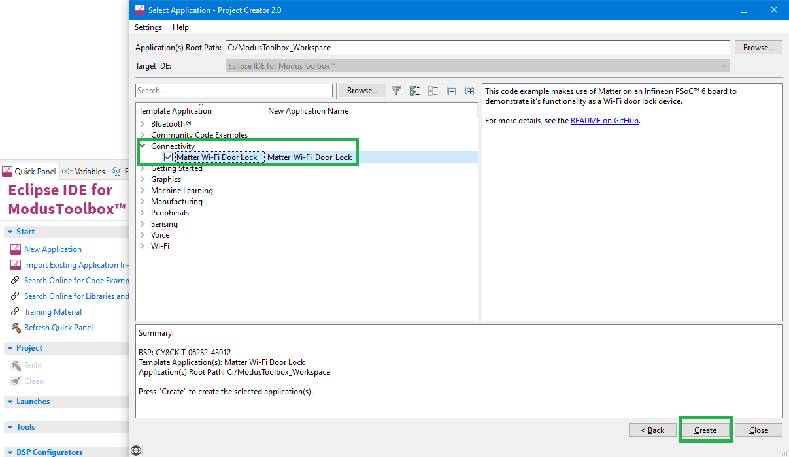
  * project creation will take some time, please be patient🤣
* in **Project Explorer** select *Matter_Wi-Fi_Door_Lock* project and hit **Build**
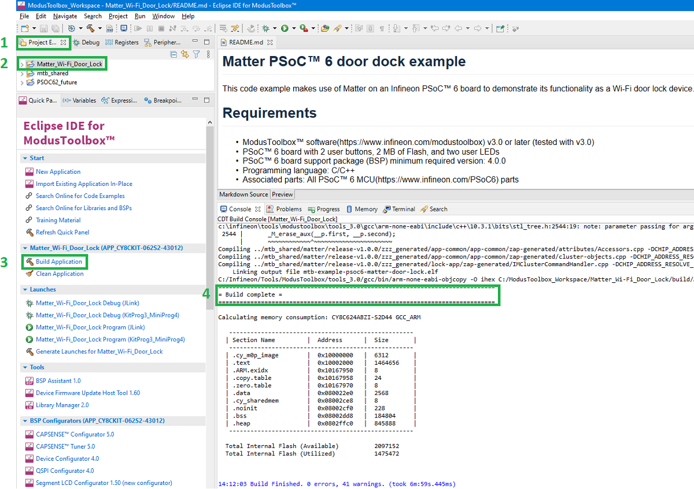
  * first build will take some time, please be patient🤣, second build is much much faster
* flash the board by selecting **Matter_Wi-Fi_Door_Lock Program (KitProg3_MiniProg4)**
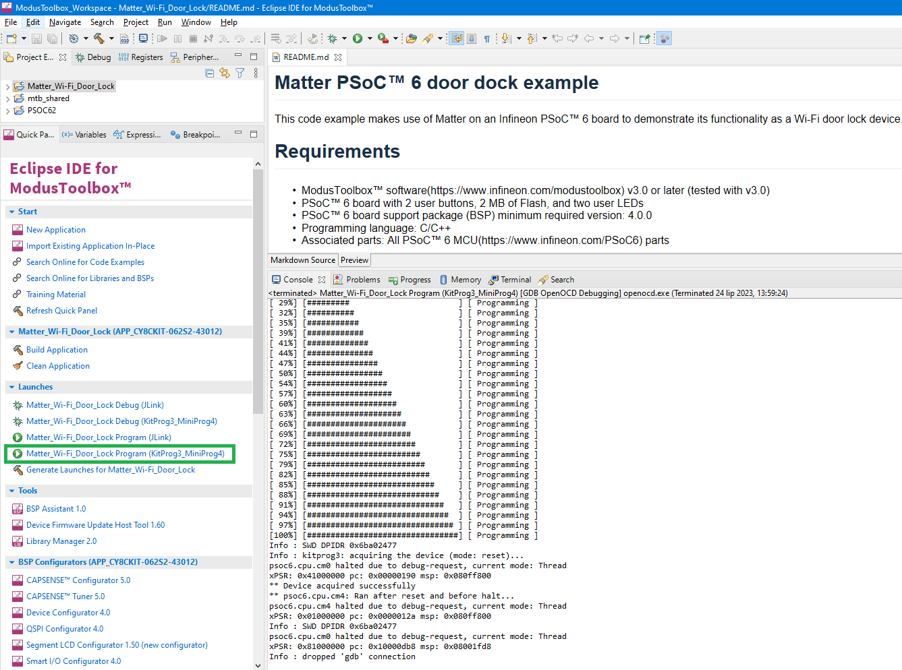
* open serial terminal (TeraTerm in my case) to see the logs:
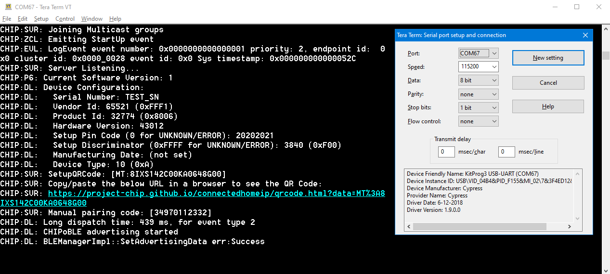
  * serial port setup is: **Port:** *COMxx*, **Speed (baud rate):** *115200*, **Data:** *8 bit*, **Parity:** *none*, **Stop bits:** *1 bit*, **Flow control:** *none*
  * if nothing is present, reset the board by hitting **XRES** (**SW1**) button
  * the most interesting content of the logs by now is QR code required to commission the board into my ecosystem, QR code is provided as a [link](https://project-chip.github.io/connectedhomeip/qrcode.html?data=MT%3A8IXS142C00KA0648G00), but I am putting it here for ease of use: 
  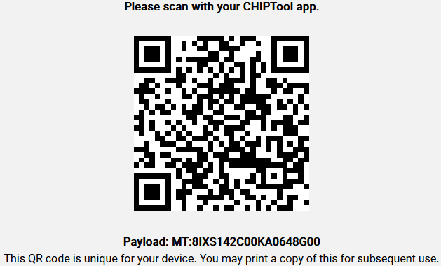
* having the firmware (door lock application) flashed and QR code prepared, I am ready now to commission the board into my ecosystem, let me check it out!😎

## Commissioning [Infineon CY8CKIT-062S2-43012]
The workflow here is very similar what I have seen when commissioning previous Matter accessories, i.e. [Meross MSS315 plug] (Wi-Fi plug) or [Espressif ESP32-C3-DevKitM-1] (Wi-Fi light bulb). It assumes that door lock application is flashed already:
* connect [Infineon CY8CKIT-062S2-43012] to your PC
  * use **KITPROG3 USB** (**J6**) connector on the left hand side of the board
* do factory reset by pressing **USER BTN2** (**SW4**) button
  * it opens commissioning window
* open default camera application of your iPhone
* scan the [QR code](https://project-chip.github.io/connectedhomeip/qrcode.html?data=MT%3A8IXS142C00KA0648G00) (or see this code placed above)
* follow the workflow required by the ecosystem (Apple Home in my case), keeping your phone close to the board (commissioning is being done via Bluetooth)
* finally, you get in your smart home lock accessory you can lock and unlock
  * if you want to repeat commissioning process (for example to change the network to connect to) press **USER BTN2** (**SW4**) button which triggers factory reset

You can see whole described workflow below:

## Wi-Fi door lock demo

You can toggle lock and unlock states in three scenarios:
* using iPhone only
* using **USER BTN1** (**SW2**) button only
* using iPhone and **USER BTN1** (**SW2**) interchangeably

The lock/unlock status can be observed with **LED9** (**red**):
* LED ON = locked
* LED OFF = unlocked

Please be advised that there is another LED8 (orange) and I have noticed that there are some conditions when it might be ON or OFF when status is **locked** and some conditions when it might be ON or OFF when status is **unlocked** (which might be bit confusing). Seems it somehow refers to which trigger has been used to change the status of the lock, for example: there is a difference in LED8 (orange) state when **unlocked** status has been triggered by iPhone or by button. However, this is rather side note and I would focus on **LED9** (**red**) only to check the lock/unlock status.

# Project summary
Idea of Matter is to provide interoperability, what it means for the customer/end user? You do not need to double-check whether new smart home stuff you would like to buy is compliant with your current ecosystem or not. As long as it has Matter logo you should not have any doubts about compliance with your smart home. It reflects also to your smart home setup as neither more apps nor more hubs are needed (assuming you have at least one!🤣).

So far, I did take three Matter enabled devices from different vendors, i.e.:
* [Meross MSS315 plug] (Wi-Fi plug)
* [Espressif ESP32-C3-DevKitM-1] (Wi-Fi light bulb)
* [Infineon CY8CKIT-062S2-43012] (Wi-Fi door lock)

and added them to Apple Home ecosystem and they simply work🎉

Happy Matter-ing!🏆

---
[Meross MSS315 plug]: https://shop.meross.com/products/meross-matter-plug-with-energy-monitor-mss315-eu

[TP-Link Tapo P125M plug]: https://www.tp-link.com/us/home-networking/smart-plug/tapo-p125m/

[Eve Energy plug]: https://www.evehome.com/en/eve-energy

[system requirements for Matter devices]: https://www.meross.com/en-gc/support/FAQ/553.html

[List of Matter hubs]: https://github.com/marcin-ch/Matter_User_Experience#list-of-matter-hubs

[which hub is right for me]: https://www.evehome.com/en/hub

[Espressif ESP32-C3-DevKitM-1]: https://docs.espressif.com/projects/esp-idf/en/latest/esp32c3/hw-reference/esp32c3/user-guide-devkitm-1.html

[Introduction to Matter]: https://www.youtube.com/watch?v=hN-JIiLAbRI

[Building a Matter Device]: https://www.youtube.com/watch?v=cgcImPtbnPQ

[Matter Certification & Device Certificates]: https://www.youtube.com/watch?v=GuoUZj3bro0

[ESP32-C3-MINI-1 module]: https://www.espressif.com/sites/default/files/documentation/esp32-c3-mini-1_datasheet_en.pdf

[ESP32-C3 SoC]: https://www.espressif.com/en/products/socs/esp32-c3

[ESP Launchpad]: https://espressif.github.io/esp-launchpad/?flashConfigURL=https://espressif.github.io/esp-matter/launchpad.toml

[Espressif SDK for Matter]: https://docs.espressif.com/projects/esp-matter/en/latest/esp32/developing.html#commissioning

[Infineon CY8CKIT-062S2-43012]: https://www.infineon.com/cms/en/product/evaluation-boards/cy8ckit-062s2-43012/

[Infineon PSoC62 series MCU]: https://www.infineon.com/cms/en/product/microcontroller/32-bit-psoc-arm-cortex-microcontroller/psoc-6-32-bit-arm-cortex-m4-mcu/psoc-62/

[Murata Type 1LV Wi-Fi/Bluetooth module]: https://www.murata.com/en-us/products/connectivitymodule/wi-fi-bluetooth/overview/lineup/type1lv

[Infineon AIROC CYW43012 Wi-Fi/Bluetooth chipset]: https://www.infineon.com/cms/en/product/wireless-connectivity/airoc-wi-fi-plus-bluetooth-combos/wi-fi-4-802.11n/cyw43012/

[AN237138 Getting started with Matter over Wi-Fi on PSoC6 MCUs in ModusToolbox]: https://www.infineon.com/dgdl/Infineon-AN237138_Getting_Started_with_Matter_over_Wi-Fi_on_PSoC6_MCUs_in_ModusToolbox-ApplicationNotes-v01_00-EN.pdf?fileId=8ac78c8c869190210187029c453e134c

[Project CHIP's Github Matter PSoC6 Lock Example]: https://github.com/project-chip/connectedhomeip/tree/master/examples/lock-app/infineon/psoc6

[Infineon's Github Matter PSoC6 Lock Example]: https://github.com/Infineon/mtb-example-psoc6-matter-door-lock

[Infineon’s IDE ModusToolBox]: https://www.infineon.com/cms/en/design-support/tools/sdk/modustoolbox-software/